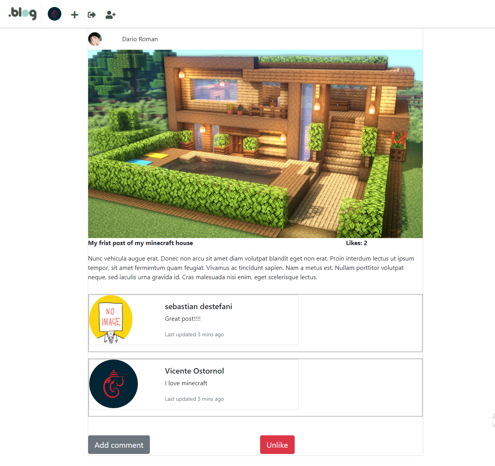

# .Blog

Create a minimal project (inspired by instagram) in Django.



## Dependencies
Python 3
Django

## Usage
```shell
python3 -m venv venv
source venv/bin/activate
pip install -r requirements.txt
```

```python
python manage.py makemigrations
python manage.py migrate
python manage.py runserver
```

